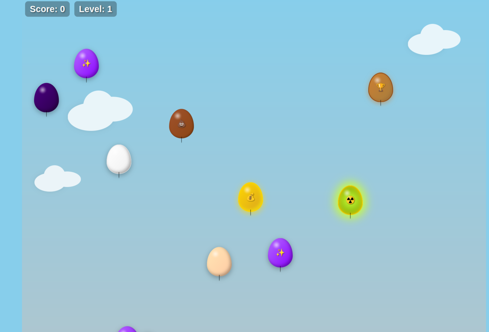

# 🎈 Balloon Blast

This is a simple balloon-popping game built with **HTML, CSS, and JavaScript**.

It’s a great starting project for newcomers to learn the basics of web development and how to combine HTML, CSS, and JavaScript for interactive browser games.

More features and improvements will be added in the future!

---

**How to play:**
- Click or tap the balloons to pop them and score points.
- Some balloons give extra points, others might reduce your score.
- Try to reach the highest level you can!

---

Feel free to explore, play, and modify the code.  
Enjoy popping balloons!
